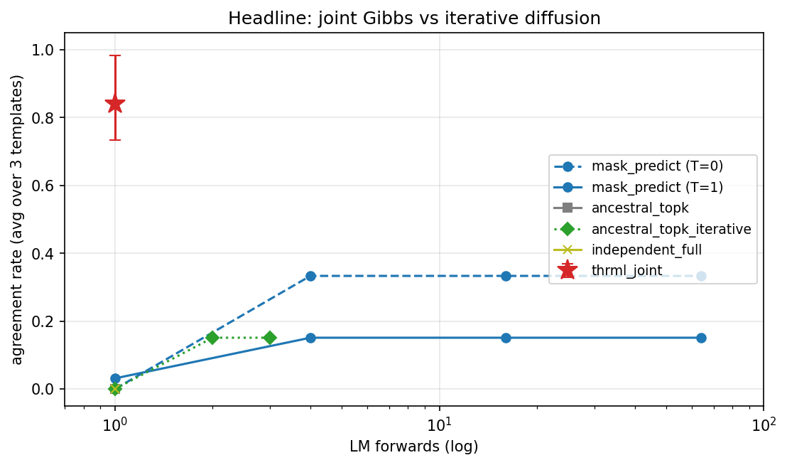
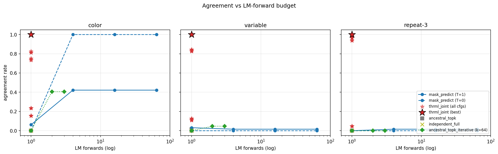
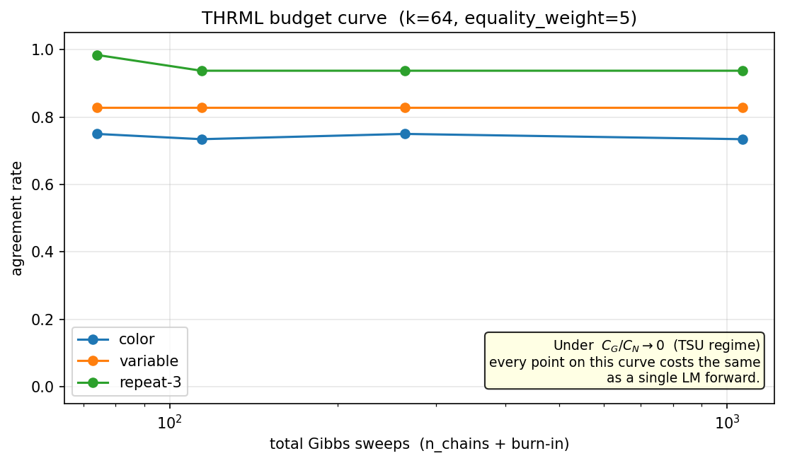
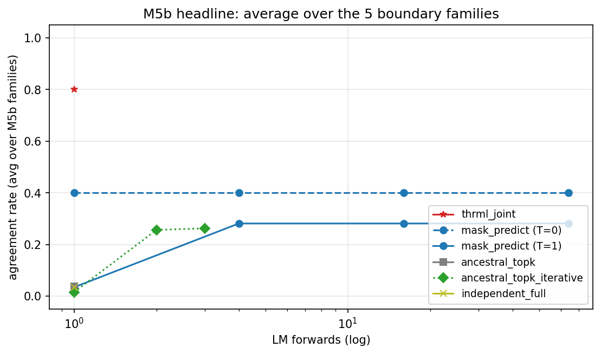
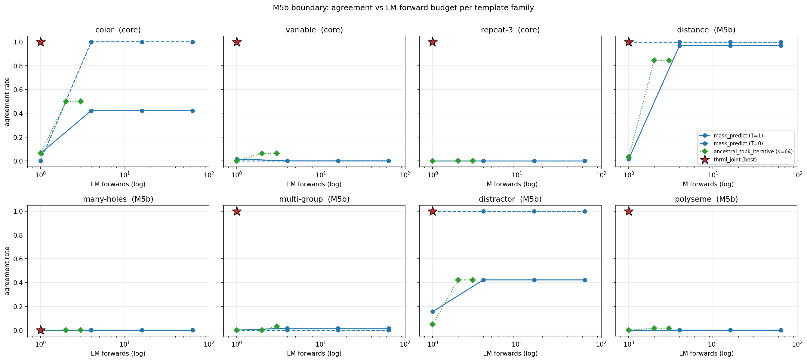

# diffusion-ebm

`diffusion-ebm` is a research prototype for combining a pretrained
masked-diffusion language model with a sparse factor-graph sampler. The
main question is:

> Given an MDLM that returns per-position categorical logits, can a
> THRML block-Gibbs sampler improve multi-hole consistency at a fixed
> neural-forward budget?

The test bed is deliberately small and inspectable. Prompts contain
multiple `[MASK]` holes that should take compatible token values. The LM
provides top-k candidate sets and unary scores. THRML samples jointly
over the resulting categorical variables with either hard equality
factors or, in the M5c scaffold, a learned pairwise factor.

## Methods

The main sweep compares:

- `thrml_joint`: one MDLM forward pass, top-k candidates at each hole,
  then THRML block-Gibbs over a factor graph with hard equality factors.
- `mask_predict`: iterative MDLM Mask-Predict decoding at temperature 0
  and 1, with up to 64 neural forwards.
- `ancestral_topk`: one MDLM forward, then independent multinomial
  draws from each hole's top-k distribution.
- `ancestral_topk_iterative`: a stronger top-k baseline that repeatedly
  forwards MDLM, samples every still-masked hole, and commits the most
  confident hole values so later forwards see them as context.
- `independent_full`: one MDLM forward, then independent full-vocabulary
  multinomial draws.

The core templates are:

- `color`: `Alice's favorite color is [M]. Bob's favorite color is also [M].`
- `variable`: `The variable [M] was assigned the value 7. Later, [M] was used in a loop.`
- `repeat-3`: `My name is [M]. You can call me [M]. I said [M] three times.`

M5b adds boundary templates for long-distance agreement, multiple holes,
multiple equality groups, distractor context, and polysemy.

## Current Results

On the three core templates, THRML reaches perfect agreement on all
templates with one MDLM forward and 74 total Gibbs sweeps
(`equality_weight=10`, `gibbs_sweeps=10`, `k=64`). The strongest
iterative baselines can tie on the easy color template, but do not
recover the variable and repeat-3 constraints.



| template | thrml_joint | best mask_predict | best ancestral_topk_iterative | ancestral_topk | independent_full |
|---|---:|---:|---:|---:|---:|
| color | **1.000** @ 1 LM | **1.000** @ 4 LM | 0.469 @ 2 LM | 0.000 | 0.000 |
| variable | **1.000** @ 1 LM | 0.031 @ 1 LM | 0.047 @ 2 LM | 0.016 | 0.000 |
| repeat-3 | **1.000** @ 1 LM | 0.016 @ 4 LM | 0.000 | 0.000 | 0.000 |

The per-template Pareto plot and THRML budget curve are generated from
`results/results.json`:




The key interpretation is that hard equality is genuine joint signal:
with only LM unaries and no cross-position term, joint Gibbs would
sample the same product distribution as independent ancestral sampling.
The factor graph matters because it contributes structure that is not
contained in the per-hole LM marginals.

## Boundary Templates

M5b asks where the hard-equality factor wins, ties, or breaks. The
summary below uses the best baseline among `mask_predict@T=0`,
`mask_predict@T=1`, and `ancestral_topk_iterative`.

| family | thrml_joint | best baseline | verdict |
|---|---:|---:|---|
| color | **1.000** @ 1 LM | 1.000 @ 4 LM | tie |
| variable | **1.000** @ 1 LM | 0.062 @ 2 LM | THRML wins |
| repeat-3 | **1.000** @ 1 LM | 0.016 @ 3 LM | THRML wins |
| distance | **1.000** @ 1 LM | 1.000 @ 1 LM | tie |
| many-holes | 0.000 @ 1 LM | 0.000 | degenerate |
| multi-group | **1.000** @ 1 LM | 0.031 @ 2 LM | THRML wins |
| distractor | **1.000** @ 1 LM | 1.000 @ 1 LM | tie |
| polyseme | **1.000** @ 1 LM | 0.016 @ 2 LM | THRML wins |

Across the five new boundary families, THRML averages 0.80 agreement at
one LM forward. The best mask-predict baseline averages 0.40 even when
allowed more forwards.




The main caveat is `many-holes`: at top-k=64, no token appears in all
four syntactic positions, so the hard equality state space contains no
consistent fill. That is a limitation of the candidate space, not a
failure of the Gibbs sampler.

## Learned Factor Scaffold

M5c replaces the hard equality table with a learned pairwise scorer:

```text
psi(x_i, x_j | context) = <f(h_a, x_i), g(h_b, x_j)>
```

`h_a` and `h_b` are MDLM hidden states at the masked positions. The
scorer is trained with Joint-Transition NCE: positives are real token
pairs from a corpus, while negatives are independently sampled from the
LM top-k marginals at each position. This targets cross-position
structure beyond the per-hole conditional distribution.

Implemented pieces:

- `src/diffusion_ebm/factors/learned.py`: `PairwiseScorer` and factor
  table construction.
- `src/diffusion_ebm/sampler/thrml_joint_learned.py`: THRML sampler
  using learned pairwise weights.
- `experiments/m5c_train.py`: synthetic and OpenWebText training path.
- `experiments/m5c_smoke.py`: local end-to-end smoke test.
- `experiments/m5c_eval.py`: evaluation sweep for a trained checkpoint.
- `notebooks/06_learned.py`: overlay plots for learned factors.

The smoke path trains a small scorer on the synthetic corpus, builds a
learned-factor THRML graph, and verifies finite agreement scores on the
color and polyseme templates.

## Repository Layout

```text
src/diffusion_ebm/
  backbones/      MDLM wrapper and decoding helpers
  factors/        unary, hard-equality, and learned pairwise factors
  metrics/        agreement and LM-perplexity scoring
  sampler/        THRML graph builders and baselines
  tasks/          prompt/template definitions
  synth/          synthetic Potts-chain sanity check
  utils/          graph coloring helpers

experiments/
  run_pareto.py   core and M5b sweep driver
  verify_m5a.py   iterative top-k baseline checks
  m5c_train.py    learned factor training
  m5c_smoke.py    learned factor smoke test
  m5c_eval.py     learned factor evaluation

notebooks/
  00_smoke.py through 08_tour_marimo.py are runnable Python notebooks
  and project-tour scripts.

container/
  diffusion-ebm.def is an Apptainer definition for CUDA cluster runs.
```

`CLAUDE.md` contains detailed working notes and host-specific
troubleshooting history. It is intentionally kept in the repo.

## Setup

The project targets Python 3.12. The pinned dependency set uses PyTorch
CUDA 12.4 wheels, JAX CUDA 12, THRML, transformers 4.x, and flash-attn.

On the NixOS development host:

```bash
nix develop
uv sync
```

For non-Nix Linux CUDA hosts, use Python 3.12 and install with `uv sync`.
If the CUDA driver library is not discoverable, set:

```bash
export LD_LIBRARY_PATH="/run/opengl-driver/lib:${LD_LIBRARY_PATH:-}"
export TRITON_LIBCUDA_PATH="/run/opengl-driver/lib"
```

The exact path is host-specific. NixOS exposes the kernel-matched driver
libraries at `/run/opengl-driver/lib`; standard Linux distributions
usually do not need that override.

## Reproduce

Basic smoke and milestone scripts:

```bash
uv run python notebooks/00_smoke.py
uv run python notebooks/01_mvp0_potts.py
uv run python notebooks/02_mdlm_bridge.py
uv run python notebooks/03_mvp1_multihole.py
```

Core sweep and plots:

```bash
uv run python experiments/run_pareto.py
uv run python notebooks/04_pareto.py
```

M5b boundary sweep:

```bash
uv run python experiments/run_pareto.py \
  --templates all \
  --out results/results_all.json
uv run python notebooks/05_boundary.py
```

M5a verification:

```bash
uv run python experiments/verify_m5a.py
```

M5c smoke:

```bash
uv run python experiments/m5c_smoke.py
```

M5c full training uses OpenWebText streaming:

```bash
uv run python experiments/m5c_train.py \
  --corpus owt \
  --steps 200000 \
  --batch 256 \
  --neg-k 16 \
  --top-k 64 \
  --seq-len 64 \
  --min-pair-dist 4 \
  --ckpt-dir results/m5c
```

The sweep driver supports `--quick` for a smaller sanity run. Generated
checkpoints, logs, and ad-hoc outputs remain ignored; the committed JSON
and PNG artifacts are the compact result set used by this README and the
tour notebooks.

## Container

Build the Apptainer image from the repo root:

```bash
nix run .#build-apptainer-image
```

Run inside the container on a CUDA host:

```bash
apptainer run --nv diffusion-ebm.sif python notebooks/00_smoke.py
apptainer run --nv diffusion-ebm.sif python experiments/m5c_smoke.py
```

The image pre-installs the Python environment and caches the MDLM/GPT-2
weights so cluster runs do not spend setup time resolving dependencies.

## Notes

- The hard-equality experiments are a clean controlled setting, not a
  claim that equality is the only useful consistency signal.
- THRML's advantage here comes from adding an explicit cross-position
  factor. Without that factor, joint sampling would not improve over
  independent sampling.
- The TSU cost framing is post-hoc: this repo verifies the algorithmic
  agreement signal with JAX/GPU simulation. Hardware cost claims belong
  to the THRML/Extropic literature.

## References

- THRML: <https://github.com/extropic-ai/thrml>
- MDLM checkpoint: `kuleshov-group/mdlm-owt`
- Sahoo et al., 2024: <https://arxiv.org/abs/2406.07524>
- Ghazvininejad et al., 2019, "Mask-Predict: Parallel Decoding of
  Conditional Masked Language Models"
